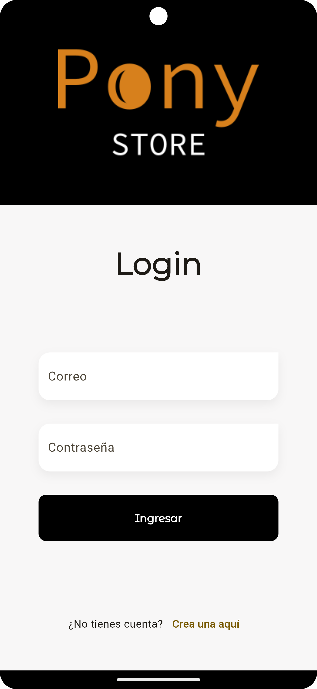
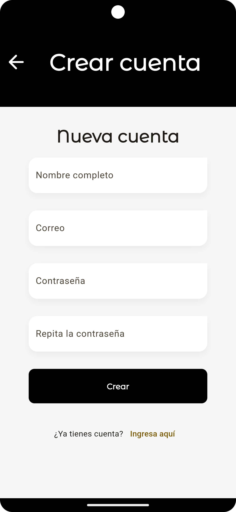
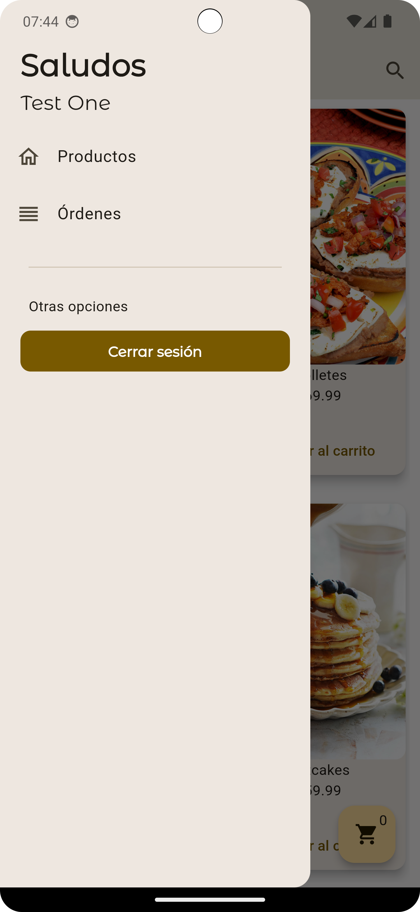
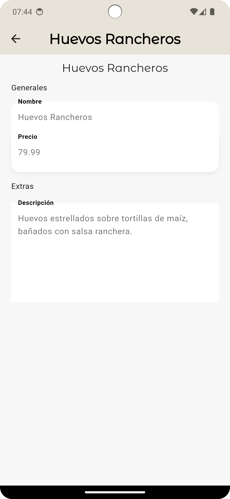
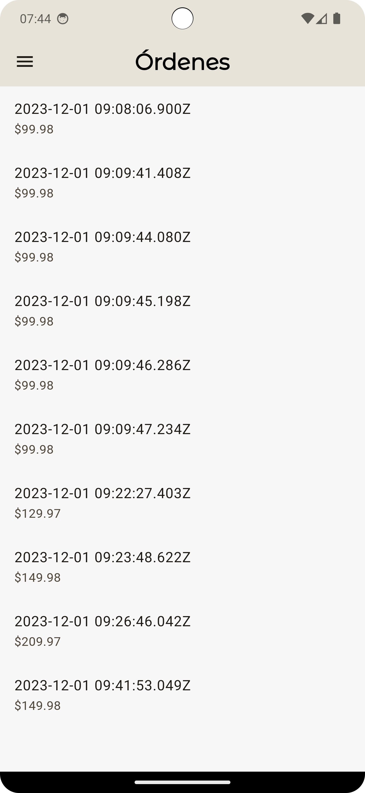
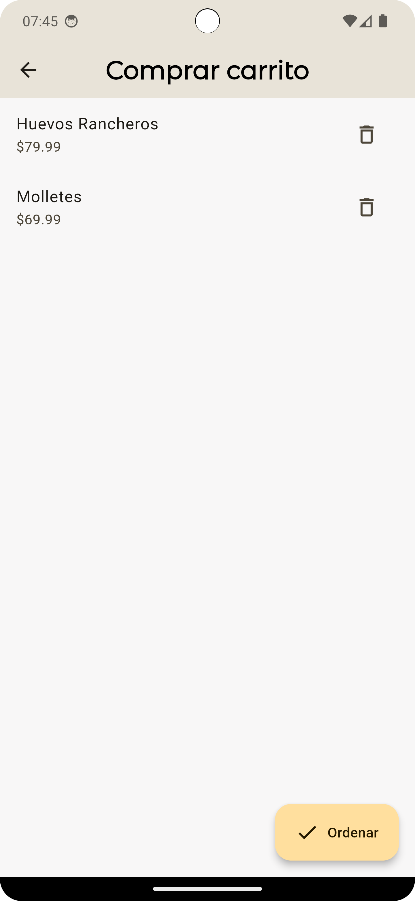
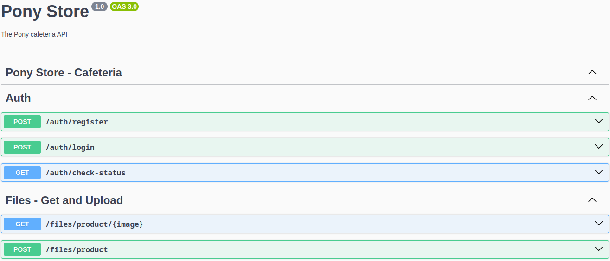

# Pony Store

## Objetivos

1. **Registro y Autenticación**: Los usuarios pueden registrarse e iniciar sesión, creando un perfil personalizado para cada uno. Esto facilita la personalización de la experiencia del usuario y permite un seguimiento eficiente de los pedidos.
2. **Carrito de Compras**: La aplicación incluye una funcionalidad de carrito de compras, permitiendo a los usuarios agregar múltiples artículos a su carrito y revisarlos antes de realizar la compra. Esto proporciona una experiencia de compra en línea completa y conveniente.
3. **Compra Posterior**: Los usuarios tienen la opción de guardar su carrito y completar la compra en un momento posterior. Esto ofrece flexibilidad a los usuarios que pueden no estar listos para realizar la compra de inmediato.
4. **Realización de Pedidos**: Los usuarios pueden explorar el menú de la cafetería, seleccionar sus artículos preferidos y realizar pedidos directamente desde la aplicación. Esto ahorra tiempo y evita las largas colas durante las horas pico.
5. **Recogida en Cafetería**: Una vez realizado el pedido, los usuarios pueden recoger su comida en la cafetería en un momento conveniente. Esto mejora la eficiencia del servicio y proporciona una experiencia de usuario sin problemas.
6. **Experiencia Personalizada**: Con el tiempo, la aplicación puede aprender las preferencias del usuario y sugerir artículos del menú basados en pedidos anteriores, ofreciendo así una experiencia personalizada.

## Mockups

## Base de datos

## RESTful API

